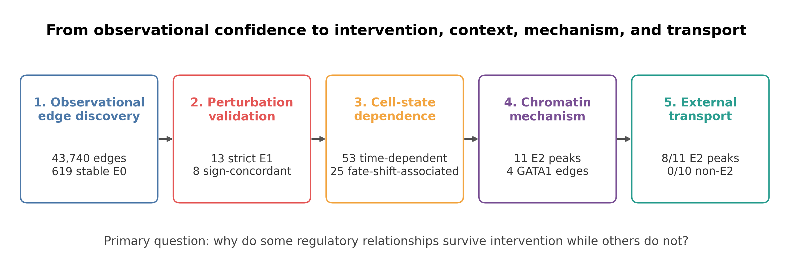

# When Does a Regulatory Edge Become Causal?

Code, frozen decision rules, compact results and manuscript for a re-analysis of
single-cell perturbation atlases in human erythropoiesis.

> Why do some TF–target relationships survive intervention while others exist
> only in observational single-cell data?

This repository treats causal credibility as an **edge × state × developmental
stage** property. Observational discovery, CRISPR response, state dependence,
local chromatin mechanism and external temporal validation are kept as separate
evidence layers; they are not collapsed into a universal score.



## Main findings

- Among 43,740 candidate edges from six erythroid TFs, 619 were stable in a
  controls-only residualized network.
- The top 1% of that ranking was enriched 2.44-fold for published
  intervention-responsive targets relative to matched null edges
  (empirical *P*=0.001); GRNBoost2 was not enriched at the same cutoff.
- Strict, state-matched day-14 validation retained 13 E1 edges, eight with the
  expected direction. All involved NFE2.
- 53/619 E0 edges were collection-time-dependent, but 25 coincided with a
  perturbation-induced shift along a controls-defined differentiation axis.
- Paired RNA/ATAC analysis identified 11 motif-supported total-effect E2 peaks
  across four GATA1 edges: *CPEB4*, *ALAS2*, *SLC25A37* and *SPTA1*. None was
  robust to adjustment for post-perturbation erythroid state.
- In an independent adult erythroid time course, 8/11 E2 peaks showed ATAC
  activation before target-RNA activation, versus 0/10 linked non-E2 peaks.
  At the edge level, 3/4 E2 edges passed versus 0/6 comparisons (Fisher's exact
  *P*=0.0333).

Together, the results support an **establishment-versus-maintenance** model:
GATA1 dependence is strongest while the erythroid chromatin programme is being
established and can attenuate after accessibility has formed.

## Evidence levels

| Level | Operational meaning in this study |
|---|---|
| E0 | Stable TF–target association inferred only from non-targeting cells |
| E1 | E0 edge with guide-consistent target-RNA response under TF perturbation |
| E2 | Edge connected to a linked, TF-sensitive, motif-supported local ACR with a compatible target-RNA response |

These labels describe this analysis and are not proposed as universal
ontological categories.

## Repository map

| Path | Contents |
|---|---|
| `src/edge_causality/` | Audits, GRN inference, perturbation models, trajectory diagnostics, chromatin and external validation |
| `config/mvp.yaml` | Frozen TF panel, thresholds, candidates and external-validation rules |
| `tests/` | Unit tests for the executable analysis components |
| `reports/` | Compact chapter reports, tables and figures |
| `manuscript/` | Initial full manuscript and manuscript figures |
| `docs/DATA_SOURCES.md` | Accessions, source links, genome builds and local paths |
| `docs/REPRODUCIBILITY.md` | Installation, execution order and interpretation safeguards |

## Quick start

Python 3.10 or newer is required.

```bash
git clone https://github.com/Joe0908/CausalRegulatoryEdges.git
cd CausalRegulatoryEdges
python -m venv .venv
source .venv/bin/activate
python -m pip install --upgrade pip
python -m pip install -e '.[test]'
pytest -q
```

Raw matrices are not redistributed. Download the public source data and place
them at the paths in [`docs/DATA_SOURCES.md`](docs/DATA_SOURCES.md). The complete
execution order is in
[`docs/REPRODUCIBILITY.md`](docs/REPRODUCIBILITY.md).

## Manuscript

- [Initial full manuscript (Markdown)](manuscript/When_Does_a_Regulatory_Edge_Become_Causal_initial.md)
- `manuscript/When_Does_a_Regulatory_Edge_Become_Causal_initial.docx`
- `manuscript/When_Does_a_Regulatory_Edge_Become_Causal_initial.pdf`
- Chapter-level result narratives:
  [E0/E1](reports/MVP_FIRST_RESULTS.md),
  [cell state](reports/CHAPTER2_FIRST_RESULTS.md),
  [chromatin mechanism](reports/CHAPTER3_FIRST_RESULTS.md), and
  [external validation](reports/CHAPTER4_FIRST_RESULTS.md)

## Scope and limitations

This is a targeted computational re-analysis, not a genome-wide claim that
chromatin establishment explains every regulatory edge. The primary libraries
are treated as batch strata rather than independent donors; guide efficacy is
heterogeneous; post-treatment state adjustment changes the estimand; motif
occurrence and peak–gene correlation do not prove physical binding or contact;
and adult external validation is stage-resolved bulk RNA/ATAC.

## Citation

This work is currently a manuscript draft. Until a preprint or archival DOI is
available, use the metadata in [`CITATION.cff`](CITATION.cff).

## License

Code is released under the [MIT License](LICENSE). Data remain subject to the
terms of their original repositories.
