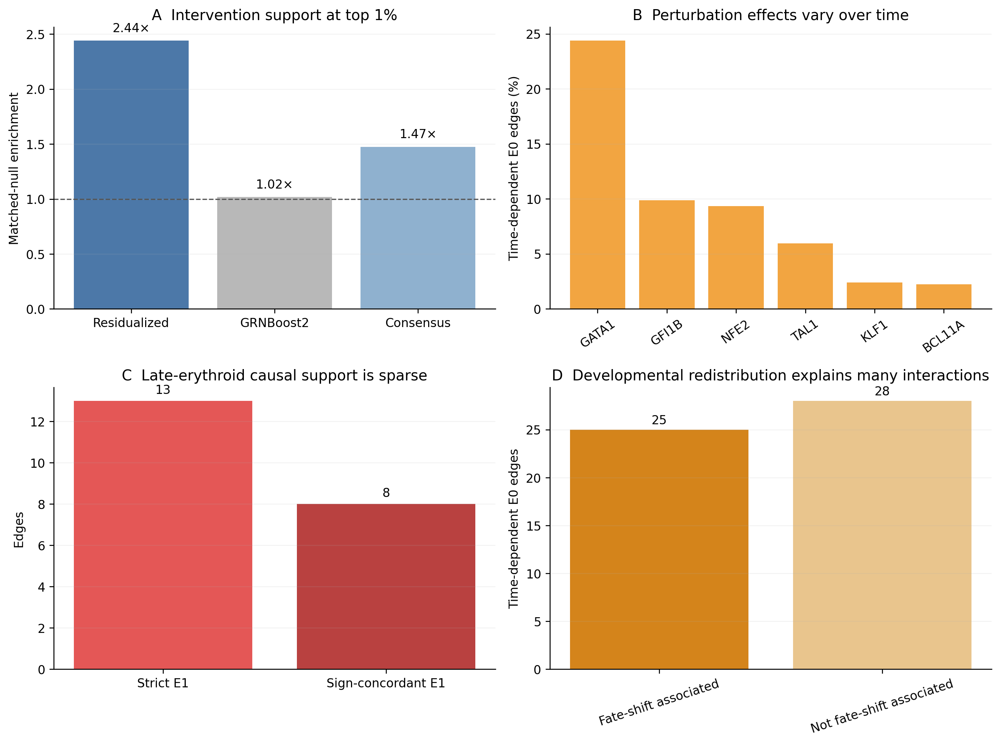
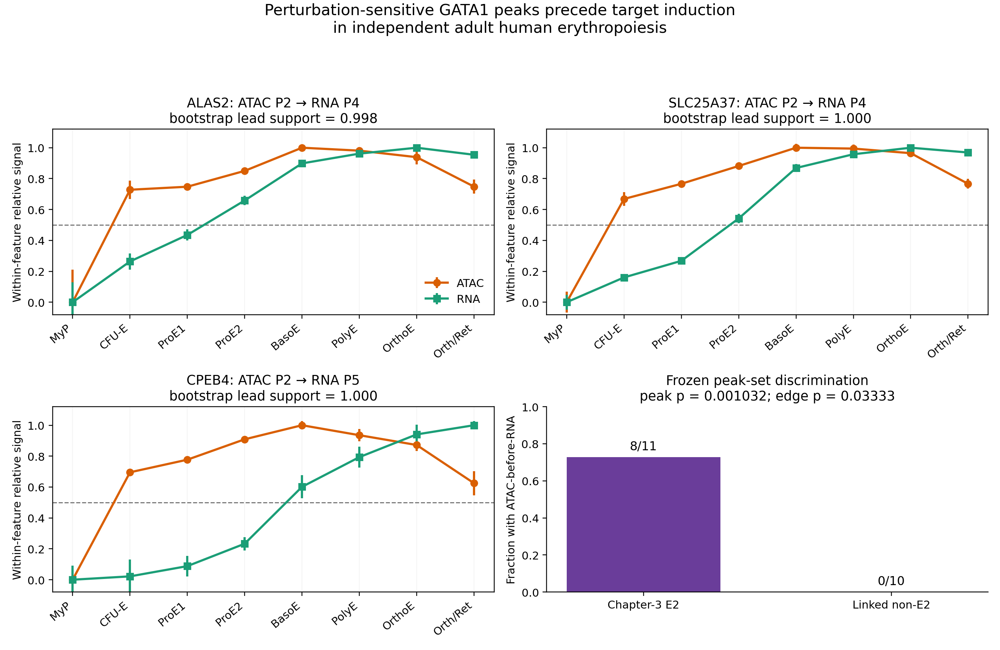

# When Does a Regulatory Edge Become Causal?

## Cell-state and chromatin dependence of gene regulation in a single-cell perturbation atlas

**Yuqi Tao**  
Independent Researcher, Manchester, United Kingdom  

**Manuscript status:** Initial full draft, 20 August 2026  
**Correspondence:** to be confirmed before submission

---

## Abstract

Single-cell transcriptomes support the inference of large gene regulatory
networks, but an observational transcription factor (TF)-to-target association
does not establish that the target will respond when the TF is perturbed. Here,
we asked why some regulatory edges survive intervention whereas others are
restricted to observational single-cell data. We re-analysed a human
Perturb-multiome atlas of haematopoietic differentiation, separating
controls-only edge discovery from CRISPR-based validation, cell-state
heterogeneity, chromatin mechanism, and external temporal validation. Among
43,740 candidate edges from six erythroid TFs, the top 1% of a residualized
signed association ranking was enriched 2.44-fold for published
intervention-responsive targets relative to expression- and detection-matched
null edges (empirical *P*=0.001), whereas GRNBoost2 showed no enrichment. Strict
late-erythroid pseudobulk validation identified only 13 E1 edges, emphasizing
that observational confidence was concentrated in a narrow upper tail. Across
four collection times, 53 of 619 stable observational edges showed significant
perturbation-by-time interactions, but 25 coincided with perturbation-induced
movement along a controls-defined differentiation axis. Targeted paired RNA and
ATAC analysis identified 11 motif-supported E2 peaks across four GATA1 edges
(*CPEB4*, *ALAS2*, *SLC25A37*, and *SPTA1*). None remained significant after
conditioning on post-perturbation erythroid state. Contrary to a simple
permissive-gate model, baseline accessibility correlated negatively with both
ATAC and RNA perturbation-effect magnitude. In an independent adult erythroid
time course, 8 of 11 E2 peaks, but 0 of 10 linked non-E2 peaks, became accessible
before target-RNA activation; three of four E2 edges passed the prespecified
temporal criterion versus zero of six comparison edges (edge-level Fisher's
exact *P*=0.033). These results support an establishment-versus-maintenance
model in which regulatory dependence is strongest while a lineage programme is
being established and can attenuate after the chromatin state has formed. More
generally, causal credibility is an edge-, state-, and developmental-stage
property rather than an intrinsic attribute of an observational network.

## Introduction

Single-cell RNA sequencing has made it possible to infer regulatory structure
from thousands to millions of heterogeneous cells. Methods based on
co-expression, tree-based prediction, cis-regulatory motif enrichment, dynamic
trajectories, and joint RNA–chromatin measurements can nominate TF–target
relationships at scale [1–5]. These networks have become central to analyses of
cell identity, differentiation, disease, and in silico perturbation. Yet the
word “regulatory” often carries a stronger interpretation than the underlying
data support. A TF and a target can covary because one regulates the other, but
also because both follow differentiation, cell-cycle, stress, batch, or an
unmeasured upstream programme. Even a reproducible, motif-supported edge can
therefore fail to predict the response to intervention.

Pooled CRISPR screens with single-cell readouts provide a direct route from
association to intervention [6–8]. Perturb-seq identifies the molecular response
to a genetic perturbation in individual cells, while perturbational epigenomic
assays can connect transcriptional responses to changes in chromatin
accessibility [9]. However, intervention does not automatically make every
downstream comparison simple. Perturbations can change which cell states are
occupied, alter the rate of progression along a developmental trajectory, or
produce different molecular effects in different states. Cell labels observed
after perturbation can themselves be mediators or colliders. Thus, an atlas-wide
perturbation response, a response within a terminal cell state, and a response
after conditioning on post-treatment state correspond to different estimands.

Chromatin introduces a second layer of context. A common model proposes that a
TF–target edge is effective when the relevant cis-regulatory element is open.
Joint single-cell RNA and ATAC measurements make this model testable by asking
whether a candidate element is accessible, linked to target expression,
TF-sensitive under intervention, and supported by the TF motif [4,10]. But the
relationship between accessibility and regulatory dependence need not be
monotonic. A TF may be required to establish an accessible state but become less
important once that state is maintained by additional factors or lineage
memory. Under this alternative, perturbation effects should be strongest early,
when baseline accessibility is still low, and decline as the locus opens.

Human erythropoiesis provides a useful system in which to distinguish these
possibilities. It follows an ordered differentiation trajectory, is controlled
by well-studied TFs including GATA1, NFE2, KLF1, TAL1, GFI1B and BCL11A, and is
represented by both perturbational multiome data and independent stage-resolved
RNA/ATAC datasets [11–13]. The Perturb-multiome atlas generated by
Martin-Rufino and colleagues profiled 19 master TF perturbations across human
haematopoietic differentiation with paired gene-expression and chromatin
accessibility readouts [11]. This design permits observational network
inference and intervention testing within the same experimental system, while
independent fetal and adult atlases provide tests of temporal transport [12,13].

Here, we developed a deliberately staged analysis. Candidate edges were first
inferred from non-targeting cells only (E0). Perturbed cells were then used to
test transcriptomic response (E1), collection-time dependence, movement along a
controls-defined differentiation axis, and local chromatin mechanism (E2).
Finally, E2 peaks were frozen and evaluated in independent differentiation
datasets. The analysis was not designed as a benchmark of many machine-learning
models, nor as a universal causal score. It addressed a biological question:
when does an observational regulatory relationship remain valid under real
intervention?

## Results

### A staged framework separates observational confidence, intervention, context, and mechanism

We analysed GSE274113, the single-cell Perturb-multiome component of a human
haematopoietic TF perturbation study [11]. All 14 RNA/ATAC libraries opened
successfully, and all 137,604 cells passing the authors' quality-control filters
were matched to their corresponding 10x matrices. The libraries contained an
identically ordered set of 36,601 RNA features and between 93,574 and 100,809
ATAC features. Public metadata did not identify library replicates as
independent donors; throughout, they were therefore treated as library or batch
strata rather than units of donor-level replication.

The primary TF panel comprised GATA1, NFE2, GFI1B, BCL11A, TAL1 and KLF1. These
TFs were selected before network inference because of their central roles in
erythroid differentiation and sufficient guide representation at day 14. The
late-erythroid primary analysis contained 22,437 cells (13,317 orthochromatic
and 9,120 polychromatic erythroblasts), including 1,304 cells carrying the
non-targeting NT_1, NT_2 or NT_3 guides for strict observational discovery.
AAVS1 guides were reserved as cutting controls for intervention comparisons.

The workflow comprised five layers (Figure 1): controls-only observational
discovery; perturbational RNA validation; dependence across collection time and
erythroid state; targeted chromatin mechanism; and external temporal transport.
We use E0 for a stable controls-only TF–target association, E1 for an E0 edge
with guide-consistent target-RNA response, and E2 for an edge linked through a
specific local accessibility element with concordant perturbational and motif
evidence. These labels describe evidence in the present analysis and are not
claimed as universal ontological categories.

### Intervention support is concentrated at the extreme top of the observational ranking

We compared two observational strategies across 43,740 possible edges from the
six TFs to 7,291 eligible expressed genes. The first was a signed association
after residualizing target and TF expression for library depth, batch and late
erythroid state. The second was GRNBoost2, a scalable gradient-boosting method
for network inference [2]. The residualized network was bootstrapped 100 times
within batch and cell-state strata. An edge was called stable if it appeared in
the top 5% of the TF-specific ranking in at least 70 bootstraps.

This procedure retained 619 stable E0 edges: 171 for NFE2, 135 for BCL11A, 83
for KLF1, 82 for GATA1, 81 for GFI1B and 67 for TAL1. Agreement with GRNBoost2
was incomplete: 41 stable residualized edges also occurred in the GRNBoost2 top
1%, 192 in the top 5%, and 293 in the top 10%.

We calibrated the complete observational rankings against the source study's
published atlas-level TF-sensitive gene table. Among all 43,740 edges, 11,468
linked a TF to a published TF-sensitive gene, 1,833 also exceeded an absolute
published log2 fold-change of 0.25, and 1,041 were directionally compatible with
the observational sign. This comparison is a within-dataset calibration rather
than an independent validation, but it permits an intervention-based test of
ranking quality.

The strongest residualized edges were selectively enriched for intervention
support. In the top 1%, 12.0% of residualized edges linked to an
effect-size-qualified published response, compared with 4.9% in TF-,
expression- and detection-matched null samples (2.44-fold enrichment; empirical
*P*=0.001; Figure 2A). Directionally concordant support was enriched 2.75-fold
(*P*=0.001). Enrichment remained at the top 5% (1.82-fold) and top 10%
(1.51-fold), but declined with rank. GRNBoost2 showed no enrichment at the same
cut-offs (top-1% enrichment 1.02; *P*=0.490). A simple average consensus
diluted the strongest residualized signal (top-1% enrichment 1.47;
*P*=0.017).

Genome-wide discrimination remained modest: for effect-size-qualified
intervention support, the residualized ranking had AUROC 0.526 and AUPRC 0.048.
Thus, the key result was local rather than global. Observational confidence was
useful in a narrow upper tail, but neither ranking supported broad causal
validity of the inferred network.

### Strict late-erythroid E1 validation is sparse and exposes guide-efficacy heterogeneity

To obtain an internal, state-matched intervention test, we aggregated guide ×
library × late-erythroid-state pseudobulks and compared targeting guides with
AAVS1 controls. Guide efficacy was assessed using a cross-fitted, Mixscale-style
score: the perturbation signature for each held-out guide was learned only from
the other guides targeting the same TF and standardized against locally matched
control cells. NFE2 and KLF1 had three effective guides; BCL11A had two; GATA1
and GFI1B had one; and TAL1 had none under the frozen screen.

An E1 call required FDR<0.05, |log2 fold-change|≥0.25, at least two effective
guides, agreement of guide-specific directions, and preservation of direction
under leave-one-guide-out analysis. Only 13 of 619 E0 edges passed, of which
eight were directionally concordant with the observational edge under TF loss
(Figure 2C). All 13 involved NFE2. This low count did not meet the initial
planning target and no threshold was relaxed. It reflects a deliberately strict
within-day-14 estimand, guide-efficacy heterogeneity, and the absence of
independent donor replication. The contrast with the broader published
atlas-level responses motivated an explicit test of developmental context.

### Collection-time dependence is common, but developmental redistribution explains many apparent edge failures

We next tested the 619 E0 edges across days 7, 9, 11 and 14. Collection time was
assigned before perturbation and was therefore used as the primary context.
Weighted pseudobulk models included perturbation, library, and
perturbation-by-time interactions. Fifty-three edges (8.6%) had a joint
interaction FDR<0.05. The fraction varied substantially by TF: 24.4% for GATA1,
9.9% for GFI1B, 9.4% for NFE2, 6.0% for TAL1, 2.4% for KLF1 and 2.2% for BCL11A
(Figure 2B).

The prespecified effect-shape classifier assigned 29 edges as gated, one as
reversed, 23 as other state-dependent patterns, 15 as guide-unstable, one as
constitutive, and 550 as having no detected interaction. “No detected
interaction” denotes an absence of evidence, not evidence of invariance.

Atlas-supported edges that failed strict day-14 E1 were over-represented among
time-dependent edges. Fifteen of 62 such edges (24.2%) were time dependent,
compared with 38 of 557 other E0 edges (6.8%; odds ratio 4.36; Fisher's exact
*P*=6.32×10⁻⁵). On its own, this pattern could be interpreted as a late-state
gate. However, a perturbation may also change the developmental states occupied
by the cells.

We therefore trained a differentiation axis using only NT_1/2/3 control
pseudobulks. Two thousand variable genes were scaled and represented by ten
principal components, and a ridge model predicted collection time under
leave-one-library-out validation. The axis explained 96.4% of variance in the
selected PCs and recovered time with R²=0.987 and mean absolute error 0.23 days.
The 95th percentile of control-guide shifts was 0.547 days.

Eight TF-by-timepoint shifts passed the frozen FDR, effect-size and
guide-consistency criteria: GATA1 at days 7, 9 and 11; GFI1B at days 7, 9 and
11; NFE2 at day 11; and TAL1 at day 11. Of the 53 time-dependent E0 edges, 25
were associated with a supported TF-level trajectory shift at the edge's
strongest timepoint (Figure 2D). All 15 atlas-supported/day-14-unsupported
time-dependent edges fell in this group. After excluding fate-shift-associated
edges, the original enrichment disappeared (odds ratio 0; Fisher's exact
*P*=0.100).

This negative-control analysis changed the interpretation. The 4.36-fold
enrichment did not demonstrate a purely cell-intrinsic chromatin gate. Instead,
many observational edges failed in terminal erythroid cells because TF
perturbation altered developmental progression and because the total molecular
effect was concentrated in an earlier context.

### Within-state analysis leaves two heterogeneous candidates but no unambiguous cell-intrinsic edge

As a secondary diagnostic, we fitted perturbation-by-author-erythroid-state
interactions across CFU-E, proerythroblast, basophilic, polychromatic and
orthochromatic erythroblast pseudobulks. These labels were assigned after
perturbation and may lie on the causal path; the analysis was therefore treated
as a persistence sensitivity analysis rather than the primary causal test.

Nine of 619 edges showed a within-erythroid-state interaction FDR<0.05. Only
two were also among the 53 collection-time-dependent edges. GATA1→*OSBP2*
changed from a −0.867 total effect at day 7 to +0.037 at day 14, and from −0.685
in CFU-E to +0.088 in orthochromatic erythroblasts. This was the cleaner RNA
candidate because the early perturbation response was compatible with the
positive observational association and the authors' reported direction.
Nevertheless, it was also fate-shift-associated. NFE2→*DCAF11* increased from
+0.028 at day 7 to +0.398 at day 14 and from −0.058 in CFU-E to +0.454 in
orthochromatic erythroblasts, but its perturbation sign conflicted with the
observational edge.

Held-out GATA2 and SPI1 perturbations produced 126 and 59 transcriptome-wide
time-interaction genes, respectively, without passing the stronger global
trajectory-shift criterion. Thus, the framework could detect context-dependent
responses that were not reducible to a large differentiation delay. For the E0
panel, however, no edge could yet be called a clean, state-intrinsic causal
relationship.

### Paired chromatin analysis supports four developmental-program edges but rejects a simple open-gate model

We froze eight candidates before inspecting local ATAC results: the primary
GATA1→*OSBP2* edge; the sign-conflict NFE2→*DCAF11* edge; four fate-shift
comparisons (GATA1→*SPTA1*, *ALAS2*, *SLC25A37*, and *EPOR*); and two positive
controls (GATA1→*CPEB4* and GATA1→*GATA2*). Within GRCh38 TSS±50-kb windows,
library-specific 10x peaks were merged to 193 consensus accessible chromatin
regions (ACRs). The targeted paired matrix contained 24,071 QC-passing cells:
4,403 GATA1-perturbed, 8,221 NFE2-perturbed and 11,447 controls.

E2 evidence required four layers. First, a controls-only peak–gene link was
tested after residualizing RNA and ATAC values for depth, library and author cell
type; the frozen criterion was FDR<0.05, |*r*|≥0.03 and at least 0.80 same-sign
frequency in 200 library-stratified bootstraps. Second, the ACR had to respond to
TF perturbation in guide-consistent pseudobulk analysis (timepoint-specific
FDR<0.05, |log2 effect|≥0.20 and at least two concordant guides). Third, the
target-RNA effect at the strongest ATAC timepoint had to be directionally
compatible and have magnitude ≥0.25. Fourth, the peak had to contain the
cognate GATA1 or NFE2 motif at a relative JASPAR 2024 PWM score ≥0.85 [14].

Of 193 peaks, 21 passed the controls-only link criterion and 31 were
ATAC-sensitive. Eleven peaks across four edges passed the link, ATAC and RNA
criteria, and all 11 contained the cognate motif. These total-effect E2 peaks
comprised two at GATA1→*SPTA1*, one at GATA1→*ALAS2*, five at
GATA1→*SLC25A37*, and three at GATA1→*CPEB4*. Motifs were common across the
candidate set (159/193 peaks passed the score threshold), and motif enrichment
among E2 peaks was not significant (*P*=0.111). Motif occurrence therefore
served as supporting annotation rather than discriminating evidence of binding.

The known *CPEB4* mechanism provided a positive calibration. Peak
chr5:173860317–173861249, 27.5 kb upstream of the *CPEB4* TSS, had a
controls-only correlation of 0.0495 (FDR=6.93×10⁻⁴), a day-7 GATA1
perturbation ATAC effect of −0.814 (FDR=8.34×10⁻⁷), a concordant RNA effect of
−0.289, and a GATA1 motif score of 0.898. This recapitulated the source study's
experimentally validated GATA1-sensitive element approximately 25 kb upstream
of *CPEB4* [11].

Neither Chapter-2 RNA candidate reached E2. For GATA1→*OSBP2*, one upstream
peak linked to *OSBP2* in controls, while five different peaks were
ATAC-sensitive; no single ACR joined the evidence chain. NFE2→*DCAF11* had no
passing controls-only local peak–gene link. These edges remained unresolved or
state-dependent RNA responses rather than chromatin-resolved mechanisms.

Crucially, the direction of the E2 trajectories opposed a simple model in which
more-open chromatin permits a stronger edge. Across all 11 E2 peaks, baseline
accessibility increased during differentiation while ATAC and RNA perturbation
effects were strongest at day 7 and weakened later. The median correlation
between baseline accessibility and absolute ATAC effect was −0.872 (range
−0.963 to −0.255); the median correlation with absolute RNA effect was −0.714
(range −0.830 to −0.466). By contrast, ATAC- and RNA-effect trajectories moved
together (median correlation +0.950; range 0.848 to 0.999; Figure 3).

None of the 11 E2 peaks remained significant after conditioning on six
post-perturbation erythroid states; median absolute-effect attenuation was
41.6%. The known *CPEB4* positive control also failed this stringent analysis.
Because post-treatment state may mediate the effect, state adjustment can remove
biologically real developmental mechanisms and can introduce selection bias.
The defensible conclusion was therefore that four edges had total
intervention-supported chromatin effects, but no candidate had demonstrated a
state-robust direct chromatin gate.

Together, these findings suggested an establishment-versus-maintenance model.
Early GATA1 activity may help establish an erythroid accessibility programme;
after the locus is broadly open, redundant factors, chromatin memory or the
stable differentiated state may reduce the acute marginal dependence on GATA1.
This model generated a prospective external prediction: E2 peaks should become
accessible before, or earlier than, the major induction of their linked targets
during independent erythroid differentiation.

### Independent differentiation data support chromatin establishment before target activation

We first evaluated the frozen Chapter-3 peaks in the Ranzoni fetal human
haematopoiesis atlas [12]. The official processed dataset contained 4,504 RNA
cells and 3,611 ATAC cells; the modalities were unpaired. Primary non-cycling
comparisons were HSC–MPP→MEMP→erythroid cells for RNA and
MPP→common-progenitor (Comm-Prog) for ATAC. Four of 11 E2 peaks and five of ten
linked non-E2 peaks directly overlapped the independently called fetal ATAC peak
set. None of the four mapped E2 peaks reached the prespecified MPP-to-Comm-Prog
accessibility threshold. However, mean GATA1 chromVAR activity rose from −0.300
in MPP to 1.418 in Comm-Prog (standardized effect 1.005; batch-stratified
bootstrap 95% CI 0.794–1.219), and *ALAS2*, *SLC25A37* and *SPTA1* showed strong
delayed RNA induction in erythroid cells. Because the ATAC sample did not include
an annotated mature erythroid state, we interpreted 0/4 as a coverage-limited
non-replication rather than evidence for temporal ordering.

We therefore applied the frozen temporal rule to the Ludwig adult human CD34+
terminal erythroid time course [13]. This dataset contains 28 paired bulk
RNA/ATAC libraries spanning eight sorted populations from two or three healthy
adult donors: P1 MyP, P2 CFU-E, P3 ProE1, P4 ProE2, P5 BasoE, P6 PolyE, P7
OrthoE and P8 Orth/Ret. Chapter-3 GRCh38 peaks were lifted to hg19, the genome
build used by Ludwig and colleagues, and only direct overlaps with independently
called ATAC peaks were retained. All 21 frozen E2 and linked non-E2 peaks lifted
successfully and overlapped an external peak.

For each feature, activation was defined before inspecting the profiles as the
first post-P1 population reaching 50% of the increase from P1 to the maximum.
Both ATAC and RNA required a dynamic range of at least 1.0 log2 CPM. A peak
passed when ATAC activation preceded RNA activation by at least one population
and this lead occurred in at least 80% of 1,000 within-population bootstrap
draws.

Eight of 11 E2 peaks passed, compared with 0 of 10 linked non-E2 peaks
(peak-level Fisher's exact *P*=0.00103). Because peaks linked to the same target
are not independent, the primary enrichment test used edges: three of four E2
edges passed versus zero of six linked non-E2 comparison edges (Fisher's exact
*P*=0.0333; Figure 4).

The GATA1→*ALAS2* E2 peak activated at P2 (CFU-E), whereas *ALAS2* RNA reached
its midpoint at P4 (ProE2; bootstrap lead support 0.998). Four of five
GATA1→*SLC25A37* peaks activated at P2–P3 before the P4 RNA midpoint (support
0.998–1.000); the fifth peak was a genuine exception and opened at P5.
All three GATA1→*CPEB4* E2 peaks activated at P2, three stages before the P5
RNA midpoint (support 1.000). GATA1→*SPTA1* was a near miss: both E2 peaks had
the expected P2 ATAC and P3 RNA point estimate, but bootstrap support of 0.717
and 0.742 did not meet the frozen 0.80 threshold.

The linked non-E2 peaks failed for informative reasons. *OSBP2* and one
*CPEB4* comparison peak lacked sufficient accessibility dynamics. The linked
non-E2 *ALAS2* peak opened at the same stage as RNA, and non-E2 *SPTA1* and
*SLC25A37* peaks opened at or after the RNA midpoint. Thus, temporal ordering
was not a generic property of nearby accessible or expression-linked peaks; it
preferentially marked the elements that had joined the complete perturbational
E2 evidence chain.

## Discussion

This study began with a simple question: when does an observational regulatory
edge become causal? The answer was not a single score. Causal credibility was
concentrated in the extreme top of one observational ranking, sparse under
strict terminal-state intervention, dependent on developmental context, and
mechanistically strongest during chromatin establishment. These layers identify
distinct reasons why an edge can be present in observational single-cell data
yet fail under intervention.

First, network rank mattered, but the inference method mattered as much as the
rank. The top 1% of residualized associations was enriched 2.44-fold for
intervention support, whereas GRNBoost2 was indistinguishable from a matched
null. This does not imply that residualized correlation is generally superior to
tree-based inference. The result is specific to this cell population, TF panel,
covariate structure and validation target. It does show that algorithmic
importance is not equivalent to intervention credibility, and that averaging
an informative and an uninformative ranking can reduce rather than improve the
signal. Evaluating GRNs only by agreement with other observational methods would
have missed this distinction.

Second, cell-state dependence had at least two separable components. Some
perturbation effects genuinely varied across matched erythroid states, but many
time-dependent edges coincided with TF-induced displacement along the
differentiation axis. The latter is not merely a technical confounder. If a TF
controls differentiation, then changing state occupancy is part of its total
biological effect. However, it changes the meaning of the edge. An atlas-level
TF→target response may reflect a developmental programme that becomes weak in a
terminal state, rather than a direct cell-intrinsic regulatory interaction that
is switched on or off by local chromatin. The distinction is essential for
predictive models intended to simulate perturbations in a specified starting
state.

Third, paired chromatin data rejected the intuitive but incomplete proposition
that an edge becomes causal simply when its regulatory element is open. The 11
E2 peaks showed the opposite relationship: dependence on GATA1 was greatest
when baseline accessibility was lowest, and the marginal ATAC and RNA effects
declined as the elements opened. ATAC and RNA responses remained tightly
coupled, arguing that the effect was molecularly coherent even though it was not
stronger in the open state. We therefore propose that the relevant distinction
is between establishment and maintenance. A TF can be necessary to establish a
regulatory state without remaining the sole factor required to maintain it.

The independent adult erythroid time course supplied the most important test of
this interpretation. E2 peaks were not selected from the external data, and the
thresholds, coordinate mapping and comparison set were frozen before their
profiles were inspected. Eight of 11 E2 peaks, but none of ten linked non-E2
peaks, showed accessibility activation before target induction. The separation
remained significant at the edge level, which reduces the dependence among
multiple peaks assigned to one gene. The results therefore transport the
temporal signature, not merely the presence of accessible chromatin, across a
different experiment, donor structure, genome build and assay resolution.

The fetal atlas result provides an equally useful caution. Global GATA1 motif
activity increased strongly and late target induction was visible in RNA, yet
the sampled ATAC states ended too early to capture the predicted terminal locus
dynamics. A dataset can be biologically relevant but structurally unable to test
a specific temporal hypothesis. Treating absence of replication as evidence
against the mechanism without auditing state coverage would have been
misleading.

Several limitations constrain the conclusions. The primary Perturb-multiome
libraries are not documented as independent donors, so FDR values describe
within-screen evidence rather than population-level donor replication. Guide
efficacy varied substantially; strict E1 analysis could test only TFs with at
least two effective guides, and all strict hits were NFE2 edges. The source
study used single-cell genotyping because transcript abundance is not a reliable
proxy for editing; the present re-analysis used public guide and author-QC
annotations and did not recreate the complete genotype model. The E2 analysis
was targeted to eight candidates and cannot estimate the genome-wide prevalence
of establishment-type edges. Peak–gene correlation and motif occurrence do not
prove physical enhancer–promoter contact or TF binding. Conditioning on
post-perturbation state can attenuate a mediated causal effect or induce collider
bias, so the absence of state-robust E2 peaks does not prove that all 11 total
effects are indirect. Finally, the adult external validation was stage-resolved
bulk data. It provides donor and terminal-stage coverage but cannot test
cell-level co-variation.

These limitations also define the next experiments. CUT&RUN or CUT&Tag for
GATA1 across early erythroid stages would test occupancy at the 11 E2 peaks.
Targeted CRISPRi or base editing of individual elements could separate local
enhancer dependence from TF-induced fate shifts. Paired time-resolved
perturbation with lineage tracing would help distinguish changes in state
transition rates from within-state molecular responses. Applying the frozen
framework to non-erythroid lineages will determine whether establishment-before-
maintenance is a general property or a feature of erythroid regulatory
programmes.

In summary, an observational edge does not become causal merely because it is
stable, highly ranked or located in open chromatin. It gains causal credibility
when the TF perturbation changes the target in a defined context, a specific
cis-regulatory element joins the RNA and chromatin evidence chain, and the
mechanistic temporal signature transports to independent differentiation. For
the GATA1 edges identified here, dependence is greatest during the establishment
of the erythroid chromatin programme and attenuates during maintenance. This
provides a biologically interpretable answer to why regulatory relationships
learned from one single-cell context do not always survive real intervention.

## Methods

### Study design and reproducibility safeguards

All analysis thresholds, primary TFs, candidate roles and external validation
rules are recorded in `config/mvp.yaml`. Observational edge discovery used only
non-targeting cells. Perturbed cells were introduced after rankings and
candidate sets were fixed. Chapter-specific outputs were generated by command-
line modules in the `edge_causality` Python package. The project-wide random
seed was 20260820. At the time of this draft, 37 unit tests covered barcode
handling, residualization, perturbation scoring, interaction models, peak
mapping, motif support and external temporal validation.

### Perturb-multiome data and cell selection

Processed 10x HDF5 matrices and author metadata for GSE274113 were used. Blank
interleaved rows in the metadata file were removed explicitly. Each author-QC
barcode was required to occur in its stated HDF5 library, and RNA feature order
was checked across all 14 libraries. Day-14 late erythroid cells were defined by
the authors' polychromatic and orthochromatic erythroblast labels. NT_1, NT_2
and NT_3 cells formed the discovery controls. AAVS1_1, AAVS1_2 and AAVS1_3 were
the intervention reference guides.

### Cross-fitted guide perturbation scores

RNA counts were library-normalized. Cells carrying AAVS1_1 were used as a
reference population, and local control profiles were obtained from nearest
neighbours in a 30-component PCA representation of 2,000 variable genes. For a
held-out guide, a 100-gene perturbation signature was learned from cells carrying
the other guides targeting the same TF. The held-out cells were projected onto
that signature and standardized relative to control-guide cells. Guide
significance, direction consistency and the control-guide null distribution were
used to define effective guides before E1 analysis.

### Controls-only observational networks

Genes were required to have detection fraction ≥0.05 and mean CPM ≥1, and
mitochondrial-prefix genes were excluded. For each TF–target pair, log-normalized
expression was residualized against log library depth, library indicators and
late erythroid state. Pearson correlation between TF and target residuals
defined the signed association. One hundred bootstraps sampled cells within
library and state strata. Stable E0 edges occurred in the top 5% of a
TF-specific absolute-association ranking in at least 70% of bootstraps.

GRNBoost2 was run on the same controls-only expression universe. Rankings were
retained separately because their intervention calibration differed. For
descriptive overlap, residualized E0 edges were annotated by occurrence in the
GRNBoost2 top 1%, 5% and 10%.

### Calibration against published intervention responses

The authors' Table S3 TF-sensitive gene sheet was restricted to the six primary
TFs and joined to the 43,740-edge observational universe by TF and gene symbol.
Published support required a reported response and, for the primary truth
label, |log2 fold-change|≥0.25. Directional concordance accounted for the
orientation of the source perturbation score: a positive observational edge was
expected to decrease as loss of TF function increased.

AUROC and AUPRC were calculated over the complete ranking. For top-*k*
enrichment, selected edges were compared with 1,000 null samples matched by TF,
target mean-expression decile and detection-fraction decile. The empirical
one-sided *P* value was

\[
P_{emp}=\frac{1+\sum_{b=1}^{B}I(r_b\ge r_{obs})}{B+1},
\]

where \(r_{obs}\) is the selected-edge support rate and \(r_b\) is the rate in
null draw \(b\).

### Strict late-erythroid E1 validation

RNA counts were aggregated by guide, library and late erythroid state. Features
were converted to log2(CPM+0.5). For each TF, a weighted least-squares model
included an intercept, targeting-guide condition, library and cell-state
indicators; weights were proportional to pseudobulk cell count and scaled to a
median of one. The condition coefficient estimated the pooled perturbation
effect. Guide-specific effects compared each guide with AAVS1 controls in the
same library and state. Leave-one-guide-out models were refitted after omitting
each effective guide. *P* values were adjusted by the Benjamini–Hochberg method
[15]. E1 required FDR<0.05, |effect|≥0.25, at least two effective guides, complete
guide-direction agreement, and complete leave-one-guide-out direction agreement.

### Perturbation-by-collection-time analysis

All-timepoint RNA counts were aggregated by guide and library, retaining
pseudobulks with at least 15 cells. For each TF, the full weighted least-squares
model contained perturbation, library and perturbation interactions with days 9,
11 and 14; day 7 was the reference. A reduced model omitted the interaction
terms. A joint F test compared models, and interaction *P* values were adjusted
across E0 edges. Time-specific contrasts estimated effects at each collection
time. The frozen shape classifier used effect magnitude, effect range and
guide-direction consistency to label gated, reversed, amplified,
constitutive, unstable or other patterns.

### Controls-defined differentiation-axis diagnostic

The differentiation score was trained exclusively on NT_1/2/3 pseudobulks. The
2,000 most variable eligible genes were standardized and represented with ten
principal components. Ridge regression predicted numeric collection day. Model
performance was evaluated with leave-one-library-out cross-validation, after
which a final model projected all targeting and control pseudobulks. Within each
library and timepoint, each targeting guide was compared with AAVS1 guides. A TF
shift required an interaction FDR<0.05, a timepoint effect FDR<0.05, magnitude
above the 95th-percentile absolute control-guide shift and at least two
direction-consistent guides. An edge was called fate-shift-associated when its
strongest timepoint coincided with a supported shift of its TF.

### Within-erythroid-state interaction analysis

RNA counts for the 419 genes represented by E0 edges were aggregated by guide,
library and author erythroid state. BFU-E was excluded from modelling because no
AAVS1 pseudobulk passed the 15-cell minimum. The model included perturbation,
library, state and perturbation-by-state interactions across CFU-E,
proerythroblast, basophilic, polychromatic and orthochromatic erythroblast
states. Because state was observed after perturbation, results were interpreted
as persistence diagnostics and not substituted for the collection-time total
effect.

### Targeted paired RNA/ATAC candidate construction

Eight edges and their roles were frozen before local peak results were inspected.
For each target, ATAC peaks within ±50 kb of the GRCh38 TSS were collected from
all 14 libraries and merged into consensus intervals. Only author-QC GATA1,
NFE2 and control cells were retained. Library-specific presence was tracked for
each consensus peak so comparisons were restricted to libraries in which a
source peak was observed.

For controls-only peak–gene links, gene and peak values were normalized for RNA
and ATAC depth, respectively. Both were residualized against depth, library and
author cell type. Pearson correlation, BH FDR and 200 library-stratified
bootstraps were used to apply the frozen link rule. ATAC perturbation effects
were estimated in guide × library pseudobulks using the collection-time
interaction framework; at least two guide-consistent directions were required.
The target-RNA effect was estimated from the same TF and timepoint.

### Motif analysis and E2 definitions

GRCh38 peak sequences were retrieved through Ensembl resources. Both strands
were scanned using JASPAR 2024 GATA1 MA0035.5 and NFE2 MA0841.2 matrices [14].
A relative score ≥0.85 denoted motif support. A total-effect E2 peak required a
passing controls-only link, a passing TF perturbation effect on accessibility, a
directionally compatible target-RNA response of at least 0.25 at the strongest
ATAC timepoint, and motif support. A state-robust E2 peak additionally required
the ATAC effect to remain significant after adjustment for six
post-perturbation erythroid states.

### Fetal external validation

Processed RNA and ATAC data were obtained from the official repository of
Ranzoni et al. [12]. RNA used the authors' annotated PAGA object, including the
stored diffusion pseudotime [16,17]. Primary RNA states were HSC–MPP, MEMP and
erythroid cells; primary ATAC states were label-transferred MPP and Comm-Prog.
Cycling states were reserved for sensitivity analysis. Only direct overlap of
GRCh38 intervals was considered primary mapping. Per-peak ATAC profiles were
standardized across MPP and Comm-Prog cells; establishment required a committed
minus early standardized effect ≥0.25 and a batch-stratified bootstrap 95% CI
above zero. Target RNA was summarized as sample × state pseudobulk CPM. Delayed
induction required late-versus-committed log2 fold-change ≥0.5, no more than 50%
of the early-to-late dynamic range reached at commitment, and a sample-bootstrap
CI above zero. GATA1 chromVAR activity was analysed as global context, not
edge-specific evidence.

### Adult terminal erythroid external validation

Processed ATAC peaks and counts were downloaded from GSE115672 and RNA counts
from GSE115678 [13]. Sample names encoded donor, population and replicate. Frozen
GRCh38 intervals were mapped to hg19 with the UCSC hg38-to-hg19 chain; both
interval endpoints had to map compatibly, and a direct overlap with a Ludwig
ATAC peak was required. Counts were converted to log2(CPM+0.5).

Population means followed P1–P8. For ATAC or RNA, activation was the earliest
post-P1 population reaching 50% of the feature's increase from P1 to its
maximum, conditional on ≥1.0 log2-CPM dynamic range. Within each population,
libraries were resampled with replacement 1,000 times. A peak passed when ATAC
activation preceded RNA by at least one population in the point estimate and in
≥80% of bootstrap draws. An edge passed if any frozen E2 peak passed. Fisher's
exact tests compared E2 and linked non-E2 sets; the edge-level test was primary
because multiple peaks assigned to one target are dependent.

## Data and code availability

All analysis code, frozen configuration, unit tests, compact result tables and
figures are provided in the accompanying GitHub repository. Raw GSE274113 10x
matrices are not redistributed. The repository documents source accessions and
expected paths for GSE274113, E-MTAB-9067/E-MTAB-9068, GSE115672 and GSE115678.
The official Perturb-multiome and Ranzoni analysis repositories are linked in the
data manifest. A permanent archival DOI should be generated before submission.

## Acknowledgements

This independent computational re-analysis used public datasets generated by
the Martin-Rufino, Ranzoni and Ludwig studies. The author thanks the original
study participants, experimental teams and data maintainers. Additional
scientific and supervisory acknowledgements should be confirmed before
submission.

## Author contributions

Y.T. conceived the re-analysis, implemented the computational workflow,
analysed the data, interpreted the results and drafted the manuscript. This
statement should be revised if collaborators contribute to subsequent versions.

## Competing interests

The author declares no competing interests.

## References

1. Aibar, S. *et al.* SCENIC: single-cell regulatory network inference and clustering. *Nature Methods* **14**, 1083–1086 (2017). https://doi.org/10.1038/nmeth.4463
2. Moerman, T. *et al.* GRNBoost2 and Arboreto: efficient and scalable inference of gene regulatory networks. *Bioinformatics* **35**, 2159–2161 (2019). https://doi.org/10.1093/bioinformatics/bty916
3. Huynh-Thu, V. A., Irrthum, A., Wehenkel, L. & Geurts, P. Inferring regulatory networks from expression data using tree-based methods. *PLoS ONE* **5**, e12776 (2010). https://doi.org/10.1371/journal.pone.0012776
4. Bravo González-Blas, C. *et al.* SCENIC+: single-cell multiomic inference of enhancers and gene regulatory networks. *Nature Methods* **20**, 1355–1367 (2023). https://doi.org/10.1038/s41592-023-01938-4
5. Wang, L. *et al.* Dictys: dynamic gene regulatory network dissects developmental continuum with single-cell multiomics. *Nature Methods* **20**, 1368–1378 (2023). https://doi.org/10.1038/s41592-023-01971-3
6. Dixit, A. *et al.* Perturb-Seq: dissecting molecular circuits with scalable single-cell RNA profiling of pooled genetic screens. *Cell* **167**, 1853–1866.e17 (2016). https://doi.org/10.1016/j.cell.2016.11.038
7. Adamson, B. *et al.* A multiplexed single-cell CRISPR screening platform enables systematic dissection of the unfolded protein response. *Cell* **167**, 1867–1882.e21 (2016). https://doi.org/10.1016/j.cell.2016.11.048
8. Replogle, J. M. *et al.* Combinatorial single-cell CRISPR screens by direct guide RNA capture and targeted sequencing. *Nature Biotechnology* **38**, 954–961 (2020). https://doi.org/10.1038/s41587-020-0470-y
9. Rubin, A. J. *et al.* Coupled single-cell CRISPR screening and epigenomic profiling reveals causal gene regulatory networks. *Cell* **176**, 361–376.e17 (2019). https://doi.org/10.1016/j.cell.2018.11.022
10. Schep, A. N., Wu, B., Buenrostro, J. D. & Greenleaf, W. J. chromVAR: inferring transcription-factor-associated accessibility from single-cell epigenomic data. *Nature Methods* **14**, 975–978 (2017). https://doi.org/10.1038/nmeth.4401
11. Martin-Rufino, J. D. *et al.* Transcription factor networks disproportionately enrich for heritability of blood cell phenotypes. *Science* (2025). https://doi.org/10.1126/science.ads7951
12. Ranzoni, A. M. *et al.* Integrative single-cell RNA-seq and ATAC-seq analysis of human developmental hematopoiesis. *Cell Stem Cell* **28**, 472–487.e7 (2021). https://doi.org/10.1016/j.stem.2020.11.015
13. Ludwig, L. S. *et al.* Transcriptional states and chromatin accessibility underlying human erythropoiesis. *Cell Reports* **27**, 3228–3240.e7 (2019). https://doi.org/10.1016/j.celrep.2019.05.046
14. Rauluseviciute, I. *et al.* JASPAR 2024: 20th anniversary of the open-access database of transcription factor binding profiles. *Nucleic Acids Research* **52**, D174–D182 (2024). https://doi.org/10.1093/nar/gkad1059
15. Benjamini, Y. & Hochberg, Y. Controlling the false discovery rate: a practical and powerful approach to multiple testing. *Journal of the Royal Statistical Society Series B* **57**, 289–300 (1995). https://doi.org/10.1111/j.2517-6161.1995.tb02031.x
16. Wolf, F. A., Angerer, P. & Theis, F. J. SCANPY: large-scale single-cell gene expression data analysis. *Genome Biology* **19**, 15 (2018). https://doi.org/10.1186/s13059-017-1382-0
17. Wolf, F. A. *et al.* PAGA: graph abstraction reconciles clustering with trajectory inference through a topology preserving map of single cells. *Genome Biology* **20**, 59 (2019). https://doi.org/10.1186/s13059-019-1663-x

## Figure legends

**Figure 1 | Staged study design.** Observational TF–target edges were inferred
from non-targeting cells, challenged with CRISPR intervention, stratified by
collection time and erythroid state, connected to local chromatin elements, and
then evaluated for temporal transport in independent differentiation data.
Numbers summarize the principal evidence retained at each stage and should not
be interpreted as a single entity-level attrition funnel.

**Figure 2 | Observational confidence, strict intervention support, and
developmental context.** (A) Matched-null enrichment for effect-size-qualified
published intervention support among the top 1% of each observational ranking.
(B) Fraction of stable E0 edges with perturbation-by-collection-time interaction
FDR<0.05 for each TF. (C) Number of strict late-erythroid E1 edges and the subset
directionally concordant with TF loss. (D) Time-dependent E0 edges separated by
whether the strongest effect coincided with a supported perturbation-induced
shift along the controls-defined differentiation axis.

**Figure 3 | Baseline accessibility does not behave as a simple permissive
gate.** Control accessibility and absolute GATA1 perturbation effects on ATAC and
RNA are shown across days 7–14 for the *CPEB4* positive-control E2 peak, a
*SLC25A37* E2 peak, and the linked but non-E2 *OSBP2* peak. Across E2 peaks,
accessibility increased as marginal perturbation effects attenuated.

**Figure 4 | Perturbation-sensitive GATA1 peaks precede target induction in
independent adult erythropoiesis.** Within-feature normalized ATAC and RNA
trajectories are shown across eight sorted populations for representative
*ALAS2*, *SLC25A37* and *CPEB4* E2 peaks. Dashed lines denote the prespecified
50% activation threshold. The final panel compares the proportion of frozen E2
and linked non-E2 peaks showing reproducible ATAC-before-RNA ordering.

