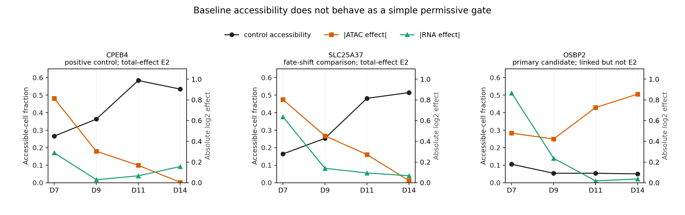

# Chapter 3 — Multiome chromatin mechanism: first results

## Result in one sentence

The paired Perturb-multiome atlas supports total GATA1-dependent chromatin/RNA
effects for **CPEB4, ALAS2, SLC25A37, and SPTA1**, but neither Chapter-2 primary
candidate (GATA1→OSBP2 or NFE2→DCAF11) reaches E2, and none of the 11 E2 peaks
remains significant after secondary adjustment for post-perturbation erythroid
state. The data therefore reject the simple claim that a regulatory edge becomes
effective merely because its enhancer is more accessible.

## Frozen design

Eight edges were fixed before inspecting local ATAC results:

- Primary Chapter-2 candidate: GATA1→OSBP2.
- Sign-conflict candidate: NFE2→DCAF11.
- Fate-shift comparisons: GATA1→SPTA1, ALAS2, SLC25A37, and EPOR.
- Positive controls: GATA1→CPEB4 and GATA1→GATA2.

The analysis uses GRCh38 TSS±50 kb windows. Library-specific 10x ATAC peaks were
merged across all 14 libraries, yielding 193 consensus ACRs. The targeted paired
matrix contains 24,071 QC-passing cells: 4,403 GATA1-perturbed, 8,221
NFE2-perturbed, and 11,447 controls.

Evidence was assigned in four independent layers:

1. **Control peak–gene link.** Only NT_1/2/3 cells were used. RNA and ATAC values
   were residualized for RNA/ATAC depth, library, and author cell type. A link
   required FDR<0.05, |r|≥0.03, and ≥0.80 same-sign frequency in 200
   library-stratified bootstraps.
2. **ATAC intervention.** Three targeting guides were compared with AAVS1_1/2/3
   in replicate-aware pseudobulk models. Support required timepoint-specific
   FDR<0.05, |log2 effect|≥0.20, and at least two guide-consistent directions.
3. **RNA concordance.** The linked peak's predicted RNA direction had to match a
   target-gene effect of at least |0.25| at the peak's strongest ATAC timepoint.
4. **Motif support.** GRCh38 peak sequences were scanned on both strands using
   JASPAR 2024 GATA1 MA0035.5 or NFE2 MA0841.2; relative PWM score≥0.85 was fixed
   before sequence retrieval.

A peak passing all four is called **total-effect E2**. A secondary, deliberately
conservative **state-robust E2** additionally requires the ATAC effect to persist
after adjustment for six post-perturbation erythroid states. Because those states
can be mediators or colliders, this secondary result is a sensitivity analysis,
not the primary causal estimand.

## Evidence funnel

- 193 local consensus peaks tested.
- 21 passed the controls-only peak–gene link criterion.
- 31 were ATAC perturbation-sensitive.
- 11 peaks across four edges passed link + ATAC + RNA-direction criteria.
- All 11 also contained the cognate motif and therefore passed total-effect E2.
- 0/11 passed the post-perturbation within-state robustness criterion.
- 0/193 showed a significant perturbation×timepoint ATAC interaction after FDR
  correction (minimum FDR 0.076).

Motifs were common: 159/193 peaks passed the 0.85 score threshold. All 11
provisional E2 peaks had a motif, but motif enrichment over the other peaks was
not significant (one-sided Fisher p=0.111). Motif occurrence is therefore a
necessary annotation here, not strong discriminating evidence of binding.

## Edge-level results

| Edge | Role | Local peaks | Linked | ATAC-sensitive | Total-effect E2 | State-robust E2 | Interpretation |
|---|---|---:|---:|---:|---:|---:|---|
| GATA1→OSBP2 | primary state candidate | 23 | 1 | 5 | 0 | 0 | Link and ATAC evidence occur at different peaks; no unified mechanism |
| NFE2→DCAF11 | sign-conflict candidate | 14 | 0 | 1 | 0 | 0 | No controls-only local peak–gene link |
| GATA1→SPTA1 | fate-shift comparison | 25 | 3 | 6 | 2 | 0 | Total effect, not shown state-robust |
| GATA1→ALAS2 | fate-shift comparison | 17 | 2 | 1 | 1 | 0 | Total effect, not shown state-robust |
| GATA1→SLC25A37 | fate-shift comparison | 30 | 8 | 8 | 5 | 0 | Strongest total-effect example; fate sensitivity remains |
| GATA1→EPOR | fate-shift comparison | 26 | 0 | 2 | 0 | 0 | ATAC response lacks a control peak–gene link |
| GATA1→CPEB4 | experimental positive control | 34 | 4 | 6 | 3 | 0 | Known mechanism recovered; within-state test is conservative |
| GATA1→GATA2 | regulatory positive control | 24 | 3 | 2 | 0 | 0 | Linked peaks, but ATAC perturbation misses the frozen FDR threshold |

## Positive-control recovery

The strongest CPEB4 peak is chr5:173860317–173861249, 27.5 kb upstream of the
CPEB4 TSS. It has a controls-only correlation of 0.0495 (FDR 6.93×10⁻⁴), a day-7
GATA1 perturbation ATAC effect of −0.814 (FDR 8.34×10⁻⁷), a concordant CPEB4 RNA
effect of −0.289, and a GATA1 motif score of 0.898. This independently recovers
the source paper's experimentally validated GATA1-sensitive element reported
approximately 25 kb upstream of CPEB4. This is an important pipeline calibration,
but its failure in the within-state sensitivity test (adjusted ATAC effect −0.118,
FDR 0.762) also shows that the latter test has low sensitivity and/or removes a
real fate-mediated component.

## The central mechanistic result is opposite to the simple gate model

For all 11 total-effect E2 peaks, control accessibility rises during
differentiation while both ATAC and RNA perturbation effects are largest at day 7
and weaken later. Across these peaks:

- median correlation between baseline accessibility and |ATAC effect|: **−0.872**
  (range −0.963 to −0.255);
- median correlation between baseline accessibility and |RNA effect|: **−0.714**
  (range −0.830 to −0.466);
- median correlation between the ATAC-effect and RNA-effect trajectories:
  **+0.950** (range 0.848 to 0.999).

Thus ATAC and RNA effects move together, but not because a pre-opened enhancer
permits regulation. A more compatible model is **establishment versus
maintenance**: early GATA1 activity helps establish an erythroid chromatin
program; after the elements become broadly accessible, their state can be
maintained or buffered and the acute marginal dependence on GATA1 declines.

The trajectory plot in
`reports/chromatin_mechanism/chromatin_trajectory_diagnostic.png` contrasts the
CPEB4 positive control, SLC25A37 fate-shift example, and the OSBP2 primary
candidate.

## What the two Chapter-2 candidates show

### GATA1→OSBP2

One peak 44.2 kb upstream links to OSBP2 in controls (r=−0.0418, FDR=0.00566),
but it is not significantly altered by GATA1 perturbation. Conversely, five
nearby peaks are ATAC-sensitive, but none passes the controls-only peak–gene link.
The evidence is split across different ACRs, so OSBP2 remains E1/state-dependent
RNA evidence rather than a chromatin-resolved E2 mechanism.

### NFE2→DCAF11

No local peak passes the controls-only link criterion. One peak is
ATAC-sensitive, but its strongest change occurs when the DCAF11 RNA effect is
near zero. This compounds the Chapter-2 sign conflict and argues against treating
NFE2→DCAF11 as a conventional activating edge.

## Within-state sensitivity analysis

None of the 11 total-effect E2 peaks is significant after adjustment for author
erythroid state; median absolute-effect attenuation is 41.6%. This is compatible
with an important fate-composition component, consistent with Chapter 2. It does
not prove that all chromatin effects are indirect because:

- cell state is measured after perturbation and may be part of the causal path;
- conditioning on it can create collider bias;
- stratification reduces effective replication and power;
- the known CPEB4 positive control also fails this stringent test.

The defensible wording is therefore: **four edges have intervention-supported
total chromatin effects, but no candidate currently has state-robust evidence for
a direct chromatin gate.**

## Revised working model

The results support three empirically distinguishable edge classes:

1. **Direct/state-robust chromatin edge:** linked ACR, TF-sensitive ATAC, RNA
   concordance, motif, and persistence within state. No example yet.
2. **Developmental-program edge:** total ATAC and RNA effects co-vary, but the
   effect is strongest during early state establishment and attenuates after
   state adjustment. SPTA1, ALAS2, SLC25A37, and probably CPEB4 fit this class in
   this atlas.
3. **Observational or unresolved edge:** RNA association/intervention evidence
   exists but no single local ACR joins the evidence chain. OSBP2 and DCAF11 are
   the current examples.

This reframes Chapter 4: independent stem-cell differentiation data should test
whether regulatory dependence peaks during **chromatin establishment**, rather
than merely asking whether mature open chromatin predicts a stronger edge.

## Reproducibility and limitations

- The analysis is candidate-targeted, not a genome-wide E2 discovery analysis.
- The 14 replicates are library/batch strata, not independent donors.
- A motif occurrence is not TF binding; independent ChIP/CUT&RUN overlap remains
  a useful orthogonal validation.
- Peak calling differs by library. A union consensus was used and every link was
  restricted to libraries in which the source peak was present.
- The source atlas and its official analysis code informed the 50-kb window and
  peak–gene correlation logic: [Perturb-multiome paper](https://pmc.ncbi.nlm.nih.gov/articles/PMC12168499/),
  [official repository](https://github.com/sankaranlab/perturb_multiome).
- Motifs are from [JASPAR 2024 CORE vertebrates](https://jaspar.elixir.no/download/data/2024/CORE/JASPAR2024_CORE_vertebrates_non-redundant_pfms_jaspar.txt),
  and sequences/coordinates use the [Ensembl REST API](https://rest.ensembl.org/).
